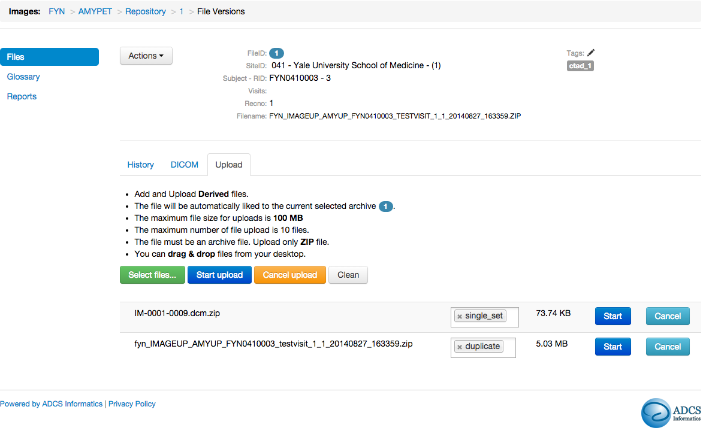

# Informatics Core

Gustavo Jimenez-Maggiora, MBA

Washington, DC

April 19th, 2015

---

# Updates

---

## New Data Portals

<table class="table-condensed center-table">
<thead>
<tr>
<th>Portal</th>
<th>Status</th>
</tr>
</thead><tbody>
<tr>
<td>FYN</td>
<td>Launched!!!</td>
</tr>
<tr>
<td>ADNID</td>
<td>Launched!!!</td>
</tr>
<tr>
<td>CCF-RAS</td>
<td>Launched!!!</td>
</tr>
<tr>
<td>LEARN</td>
<td>May, 2015</td>
</tr>
<tr>
<td>TCAD Extension</td>
<td>May, 2015</td>
</tr>
<tr>
<td>EX</td>
<td>In progress...</td>
</tr>
<tr>
<td>CSF 1</td>
<td>In progress...</td>
</tr>
</tbody></table>

---

## Amazon Web Services (AWS)

* We have migrated the majority of our Data Portals to AWS
* Remaining Data Portals:
    * A4
    * TCAD

---

## Application Improvements

* Based on user feedback, we have made improvements to the following apps:
    * Images
    * IP Tracking
    * MedDRA
    * Queries

---

# Images

---

## Improvements

* Multiple modalities
* Study-specific, multi-user collaborative workflows
* Traceability and transparency
* Tagging capabilities allow users to flexibly organize and search for images
* Manage processed or derived images
    * Link derived images to source images to establish provenance across modalities
    * Visualize and navigate using inheritance trees
    * Multi-file upload, linking and tagging
* Improved reporting and tracking of workflow inventory and performance metrics

--- &vertical

Images - Menu

***

Images - Seach

***

Images - Batch Upload, Linking and Tagging

***

Images - Amyloid Pet Workflow

***

Images - Hierarchy

***

Images - Metrics

---

## Release Schedule

* Launched on FYN
* Plan to upgrade in the next 6 months:
    * A4 / LEARN
    * INI
    * TCAD

---

# IP Tracking

---

## Improvements
* Cleaner, more intuitive interface
    * Configurable data per menu
    * Smart action links
    * Additional details…
* Advanced filters
* Color statuses
* New “Cart” interface
* Automated drug ordering
* Additional new features based on user feedback
    * Download CSV
    * Status report (interactive chart report)

--- &vertical

IPT - Menu

***

IPT - Cart

***

IPT - Status Report

---

## Release Schedule
* Launched on FYN
* TCAD - May, 2015
* INI - ?

---

# MedDRA

---

## Improvements
* Support for MedDRA updates
* Text-based search and filtering
* Improved batch actions (coding and confirmation)

--- &vertical

MedDRA - Menu

***

MedDRA - Batch Coding

---

## Release Schedule
* Launched on all active ADCS data portals!!!

---

# Queries

---

## Improvements
* Usability and Layout
    * All query related-information is visible
    * Modal vs drawer
* More filters
  * Created-by
  * Touched-by
  * Query Age
  * Tags
* Saved searches
* Tagging
* Starring - follow a query

--- &vertical

Queries - Menu

***

Queries - Search

---

## Release Schedule
* Launched on FYN and CCF-RAS
* Plan to upgrade in the next 6 months:
    * A4 / LEARN
    * INI
    * TCAD

---

How do we ensure that these changes are validated?

---

# Validation

---

<blockquote>

When any change (even a small change) is made to the software, the validation status of the software needs to be re-established.

<small>General Principles of Software validation; Final Guidance for Industry and FDA Staff</small>
</blockquote>

---

## Initial Validation

* Completed in December 2012
* Focused on Core Modules and Functionality:
    * Electronic Data Capture (EDC)
    * Queries
    * Audit Trail
    * Data Export
    * Document Repository
    * Authentication and Authorization
    * Meta-data Management

---

## Initial Validation

* Initial timeline: 3 months
* Actual time to completion: 9 months
* Traditional approach
    * Manual test execution
    * Paper-based
* Required 50k+ person hours

---

## Initial Validation

* Observations:
    * Traditional approach is resource intensive and difficult to replicate
    * Our user community demands constant innovation
    * Our business requirements are evolving and study-specific
    * By design, we have a key dependency on web browsers, which are rapidly changing

---

["Timeline of web browsers" by I, ADeveria. Licensed under CC BY-SA 3.0 via Wikimedia Commons](http://commons.wikimedia.org/wiki/File:Timeline_of_web_browsers.svg#/media/File:Timeline_of_web_browsers.svg)

---
## Rapid Change in Browsers

* Firefox and Chrome release a new version every 6 weeks
* Microsoft recently deprecated support for Internet Explorer
    * [Phaseout of Internet Explorer Stirs No Grief](http://ww2.cfo.com/mobile/2015/04/phaseout-internet-explorer-stirs-no-grief/)
* Microsoft is launching Spartan

---

Browser Share on Data Portals (Q1 2015)

---

Browser Usage on Data Portals (6 months to 3/31/2015)

---

## Initial Validation

* Conclusions:
    * Develop a new approach that effectively combines processes, standards and technology to maintain a continuous, documented, reproducible, and structured quality review of our clinical trials data management system
    * Furthermore, this new approach should allow us to rapidly validate new functionality and browser versions

---

# Automated Validation

---

## Software Development Life Cycle

* Request
* Approval
* Design
* Specification
* Requirements
* Development
* Testing
* UAT
* Release
* Configuration
* Deployment

---

## Software Development Life Cycle

* Request
* Approval
* Design
* Specification
* Requirements
* Development
* Testing
* UAT
* Release
* Configuration
* Deployment

---

## Tools

* Git (Version Control)
* Github (Cloud-based Version Control Service)
* Jenkins (Task Queue)
* Amazon Web Services (Platform as a Service)
* Robot (Automated Functional Testing)
* Foreman + Puppet (Provisioning and Configuration Management)
* Spacewalk (Package Management)

---

## Benefits
* Manage and test all software and system deliverables on a ongoing basis
    * Reproducibility
    * Flexibility
    * Scalability
    * Visibility
    * Metrics
* Testing becomes central to the overall development process

---

## Status
* We completed development of this automated validation framework in July 2014
* We completed the first round of automated validation activities in December 2014
* We achieved full coverage of all Data Portal apps in March 2015

---

## Status
* The following tests are running nightly:
    * 1k+ Functional Tests
    * 8k+ Unit Tests
* We plan to continue to expand our test coverage

--- &vertical

Request Management

***

Testing Command Center

---

Robot in Action

[test-video](https://youtu.be/D7zqlG8OlZM)

<section>
  <iframe data-src="https://youtu.be/D7zqlG8OlZM"></iframe>
</section>

---

# Roadmap

* Improvements to the Help app
* Developing new approaches to integration of external data
* Working on with LONI to add ADCS data to GAAIN
* Preparing for A5 and future studies
* Working with Safety Stats on RBM
* Working with Stats on Reporting
* Working with Biomarker on LIMS

---

# Thanks

---

